# ForPeople News

An independent local-news site with a risograph-print look: ink on cool paper, one colour per section, and photos printed in that section's ink. Readers get a live front page, opinion columns, read-aloud articles and saved stories. Editors get a password-protected newsroom for writing, editing and deleting stories.

The app lives in [`mynewsapp/`](mynewsapp).

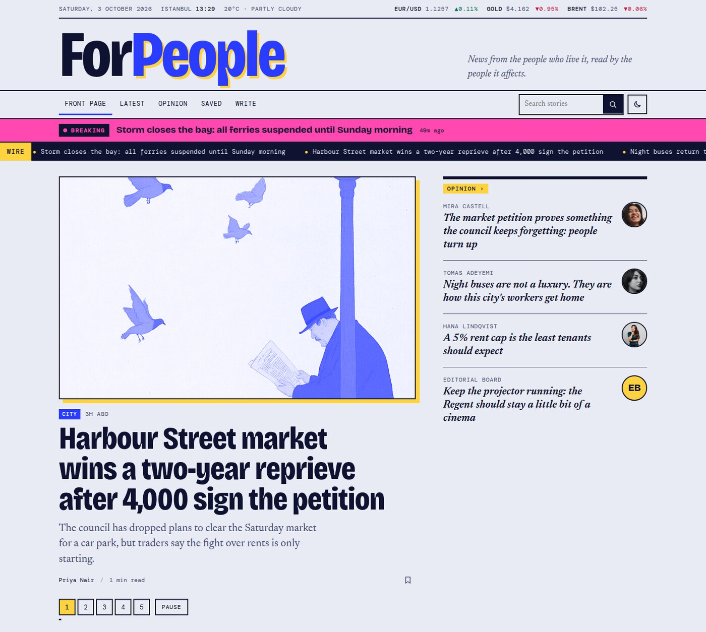

## Stack

| Layer | Technology |
| --- | --- |
| Framework | [Next.js 14](https://nextjs.org) (App Router, React Server Components, Server Actions) |
| Language and UI | TypeScript 5, React 18 |
| Database | [MongoDB Atlas](https://www.mongodb.com/atlas) through [Mongoose 8](https://mongoosejs.com) |
| Styling | Hand-written CSS with custom properties: no CSS framework. Light and dark themes |
| Fonts | Bricolage Grotesque, Newsreader and DM Mono, self-hosted by `next/font` |
| Editor auth | A shared password and an HMAC-signed, httpOnly cookie, built on Node's `crypto`. No auth library |
| Live data | [Open-Meteo](https://open-meteo.com) for weather and Yahoo Finance for market prices. Neither needs an API key |
| Browser APIs | Web Speech (read aloud), Web Share, `localStorage` (saved stories, theme), `sessionStorage` (one view per story per visit) |

## Features

### Front page

A numbered lead-story carousel with editor-pinned stories first, topped up with the newest news. It advances every 8 seconds and pauses on hover or keyboard focus. It also has a pause button and works with swipes. It never moves on its own for readers who ask their device for reduced motion. Beside it, an opinion rail lists the latest columns with each columnist's photo.

### Masthead, live data and breaking news

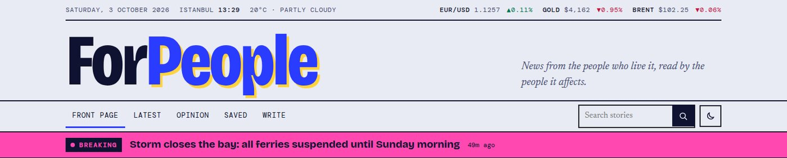

- **Utility bar:** the local date, a live clock, current weather, and EUR/USD, gold and Brent crude prices with their change since the previous close. Weather refreshes every 30 minutes and prices every 5. If a source is down, its item is left out.
- **Breaking-news banner:** appears on every page for any story an editor flags as breaking, for 24 hours after it is published.
- **Ticker:** a scrolling strip of the latest headlines. It stops for reduced-motion readers.

### Latest and Most read

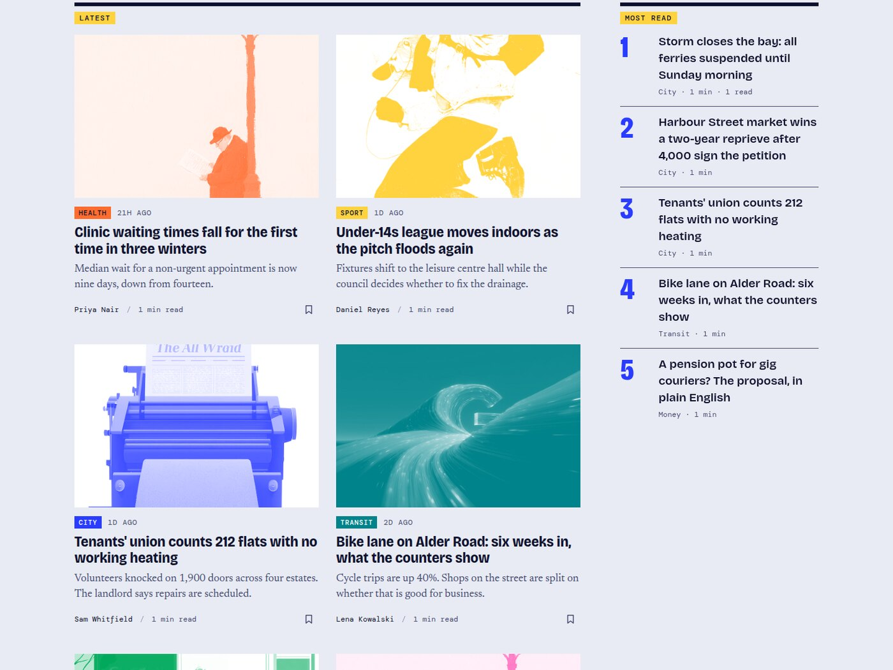

Each category prints in its own ink: City blue, Transit teal, Money green, Culture pink, Health orange, Sport yellow. The label and the duotone photo use that ink, and hovering a photo reveals its original colours. New categories get an ink automatically.

**Most read** ranks stories by real page views, counted once per story per browser visit. Stories nobody has opened yet fall back to the editor's "trending" flag.

### Section blocks

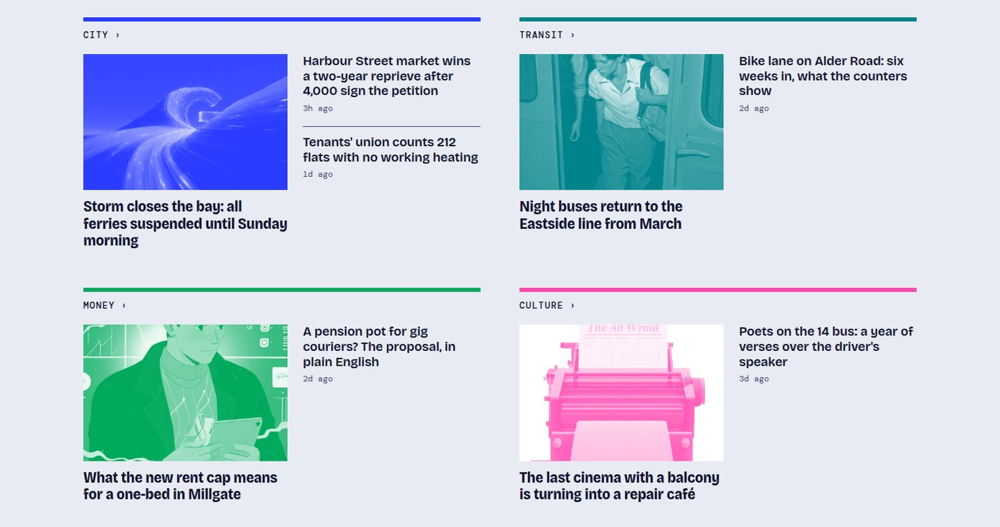

Every category with at least two stories gets a block at the foot of the front page: a lead story with a picture and a short list of headlines. This is how print newspapers lay out their sections.

### Articles

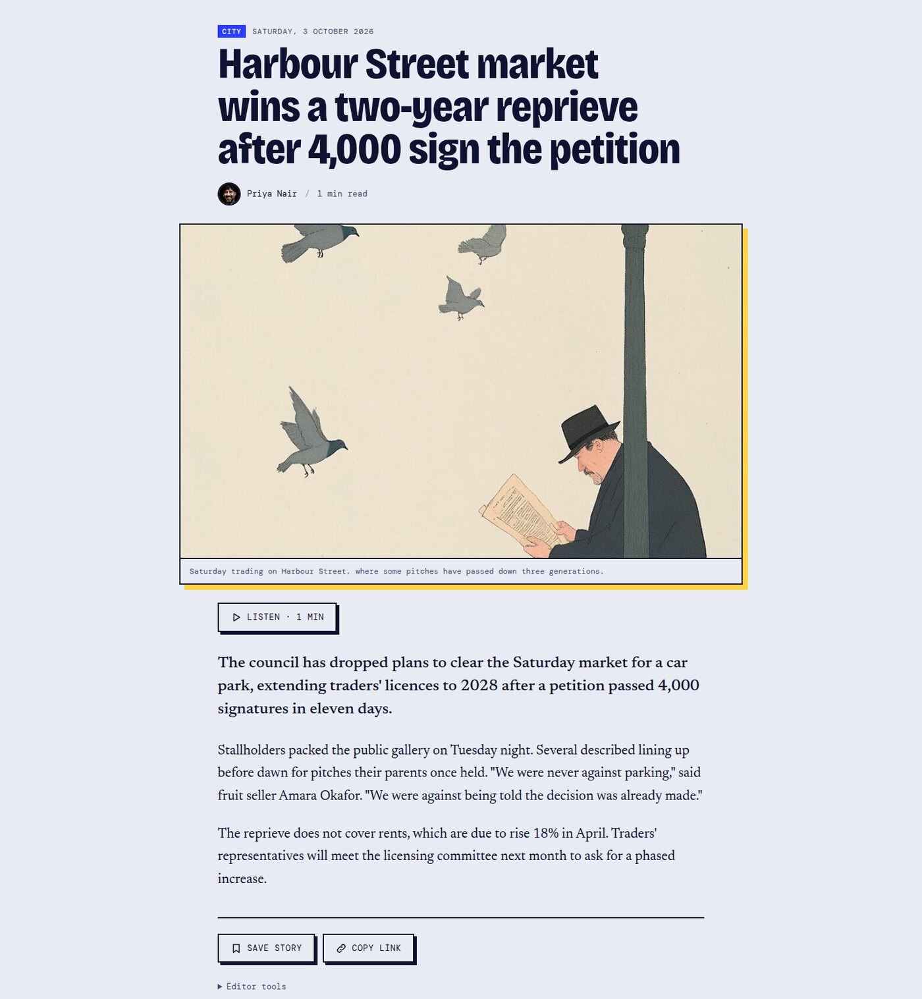

- A photo caption, a reading-time estimate and a reading-progress bar
- **Listen:** reads the story aloud using the browser's built-in speech engine
- **Save** for later, **Copy link**, and **Share** through the phone's share sheet where available
- **Keep reading:** related stories, from the same category first

### Opinion

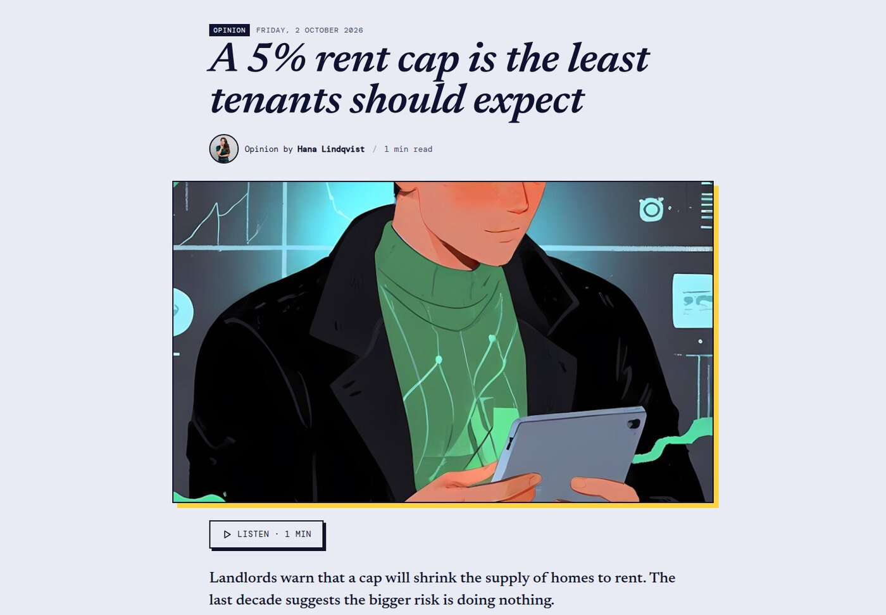

Columns and editorials are their own story type. They have their own page at `/opinion`, are labelled "Opinion" everywhere, and their headlines are set in italic serif so they never read like news. The Editorial Board gets an initials badge instead of a photo.

### Writer pages

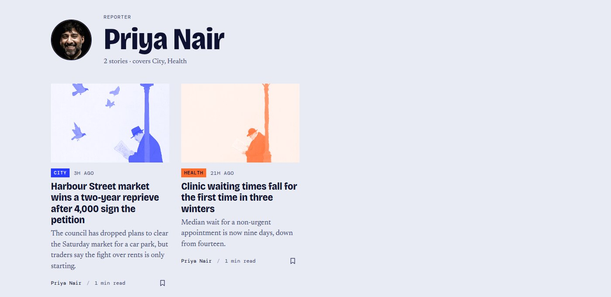

Every byline links to the writer's page at `/author/<name>`. It shows their photo, their role (reporter, columnist or both), the sections they cover and all their stories.

### Search

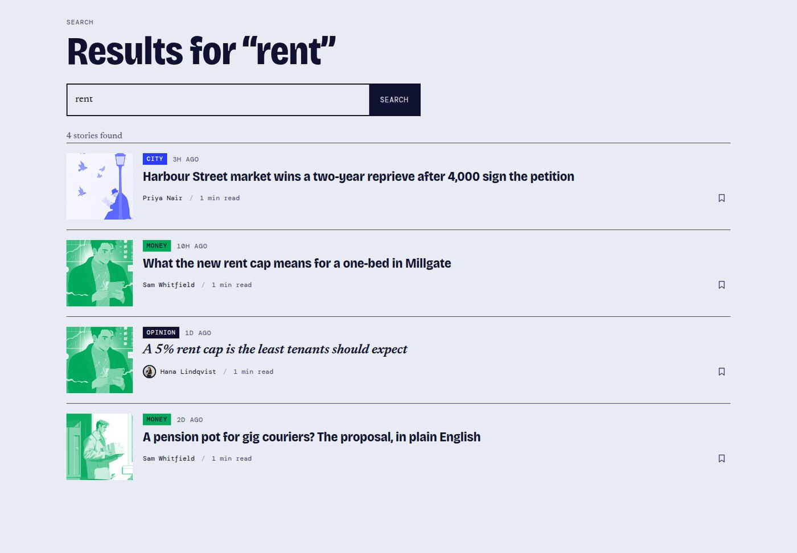

Search covers headlines, summaries, story text, bylines and categories. Every word in the query must match. When nothing does, the page suggests categories to browse instead.

### Newsletter and footer

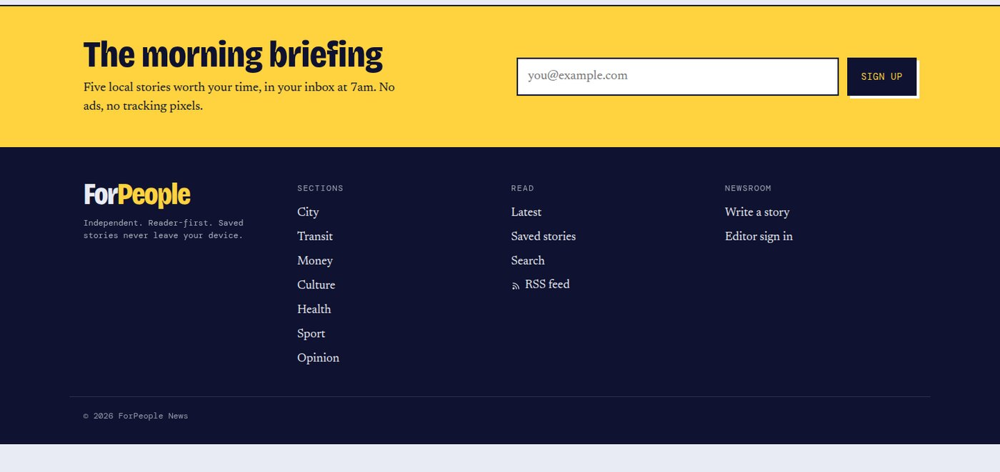

A newsletter sign-up stores email addresses in a `subscribers` collection. Signing up twice is harmless and doesn't reveal who is already on the list. The site doesn't send any emails yet. The footer links every section, the RSS feed at `/feed.xml` and the sitemap at `/sitemap.xml`.

### Dark mode and mobile

<table>
  <tr>
    <td>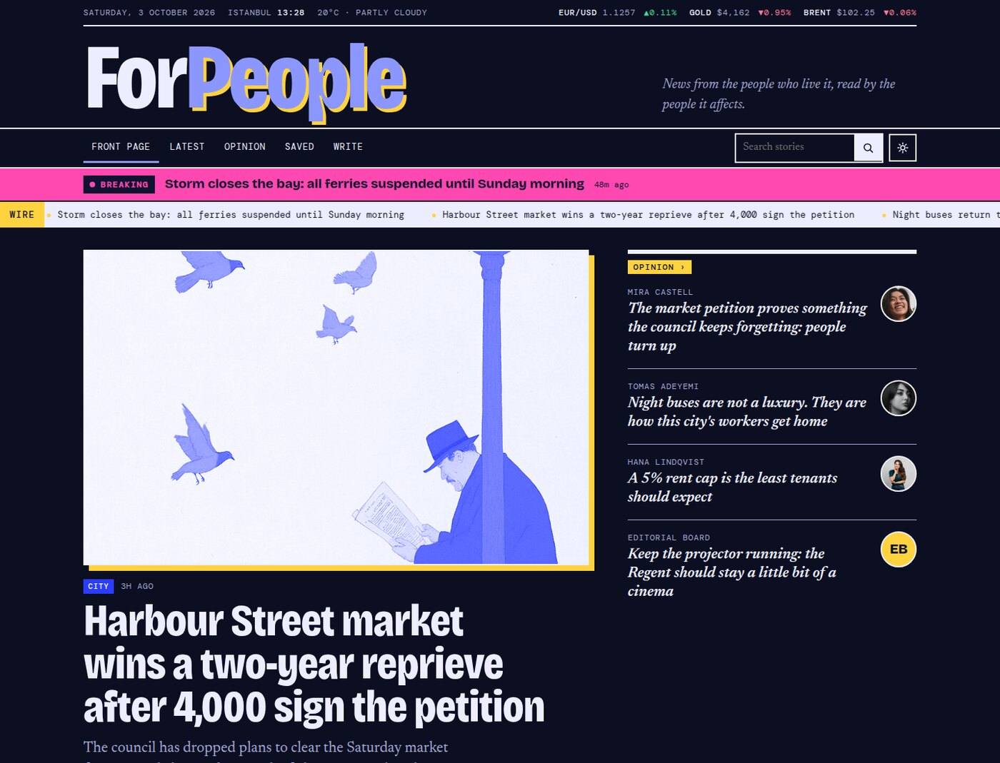</td>
    <td>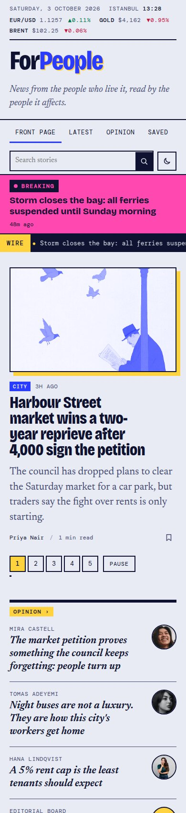</td>
  </tr>
</table>

The theme follows the reader's system setting until they pick one with the toggle, and it's applied before the page paints so there's no flash. Every page works down to phone width.

### Newsroom

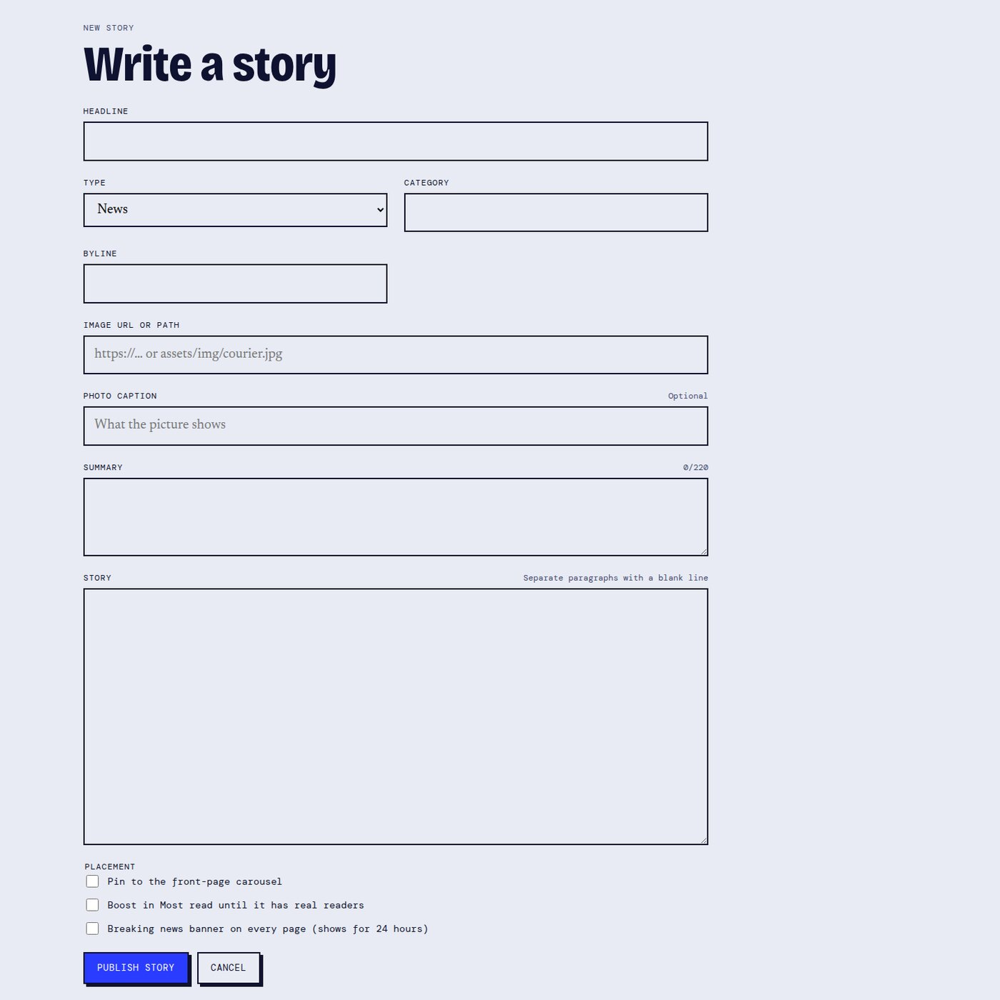

Editors sign in at `/login` with the `EDITOR_PASSWORD`. The form handles:

- **News or opinion:** the story type
- **Photo:** an image URL with a live preview, and an optional caption
- **Placement:** pin to the carousel, boost in Most read, or flag as breaking

New stories by an existing writer reuse that writer's photo automatically. The editor-only pages and every write request to the API check the editor cookie on the server.

### Saved stories

The bookmark on any story saves it to `/saved`. Saved stories are stored only in the reader's browser and never sent to the server.

### Offline demo mode

If the database can't be reached, the whole site keeps working on read-only demo stories, with a notice that publishing is paused. A story page whose database record can't be loaded shows an "offline" message instead of a 404.

## Getting started

Requires Node.js 22.18 or newer (the seed script imports TypeScript files directly).

```bash
cd mynewsapp
npm install
cp .env.example .env   # then fill in the values
npm run seed           # optional: load the demo stories into an empty database
npm run dev
```

Open http://localhost:3000.

## Configuration

| Variable | Purpose |
| --- | --- |
| `MONGO_URL` | MongoDB connection string. If the database can't be reached, the site serves read-only demo stories from `src/lib/seed.ts`. |
| `EDITOR_PASSWORD` | Password for `/login`. Signing in sets an httpOnly cookie that unlocks the editor pages and the write API. If unset, editing is open under `npm run dev` and disabled in production. |

The city, time zone, weather location and market symbols for the utility bar are in [`mynewsapp/src/lib/site.ts`](mynewsapp/src/lib/site.ts).

## Scripts

| Command | What it does |
| --- | --- |
| `npm run dev` | Start the development server |
| `npm run build` / `npm start` | Build and serve for production |
| `npm run lint` | Run ESLint |
| `npm run seed` | Fill an empty database with the demo stories |
| `npm run seed -- --sync` | Add missing demo stories and refresh existing ones, matched by title. Leaves view counts and your own stories alone |

## API

| Method | Path | Access |
| --- | --- | --- |
| `GET` | `/api/postitems` | Public |
| `POST` | `/api/postitems` | Editor |
| `GET` | `/api/postitems/[id]` | Public |
| `PUT` | `/api/postitems/[id]` | Editor |
| `DELETE` | `/api/postitems/[id]` | Editor |
| `POST` | `/api/postitems/[id]/view` | Public: counts one read |
| `POST` | `/api/subscribe` | Public |

`title`, `img`, `category` and `brief` are required when creating a story and can't be blanked on update.

## Project layout

```
mynewsapp/
├── config/db.ts          cached MongoDB connection
├── models/               Mongoose schemas and request-field whitelisting
├── scripts/seed.mjs      demo-data loader
├── docs/screenshots/     images in this README
└── src/
    ├── app/              pages, API routes, RSS feed, sitemap
    │   └── components/   UI components
    └── lib/              data access, editor auth, formatting, site settings, demo data
```
